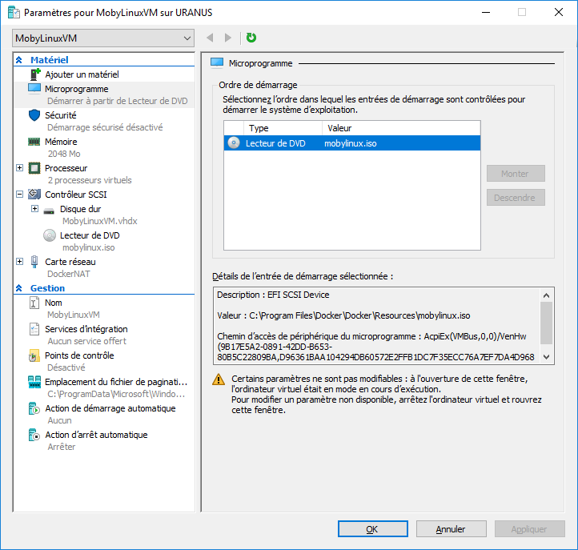

# Docker for Windows

## 1) HyperV Configuration
### a) Networking :
We have to create an Virtual Internal Switch.
- __Name__ : DockerNAT
- __Connexion type__ : Internal network

### b) Virtual Machine :
We use the ISO file named : "[MobyLinuxVM.iso](./resources/mobylinux.iso)" as micro-software.

_NOTE : MobyLinuxVM is like Boot2docker_

We have to setup a SCSI controller as a DVD reader in which we have to set a media.
This media will be an image file (ISO). The MobyLinuxVM.iso file.

In the 'Network Card' section select the virtual switch (DockerNAT) we previously created.

## 2) (Optional) Application :
You can download the last iteration of the installed docker for windows app : [here](./resources/Docker.rar).
